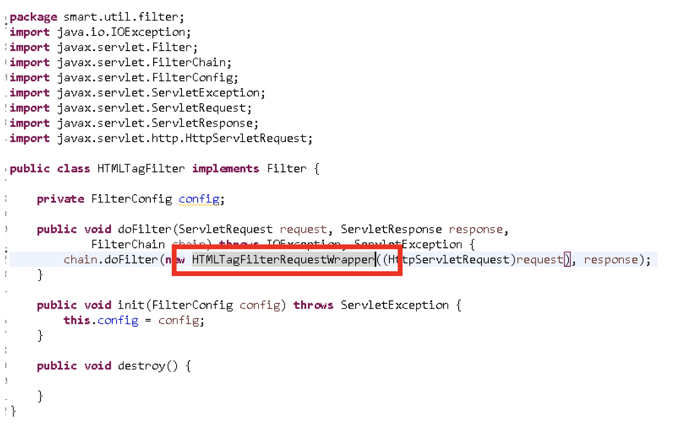
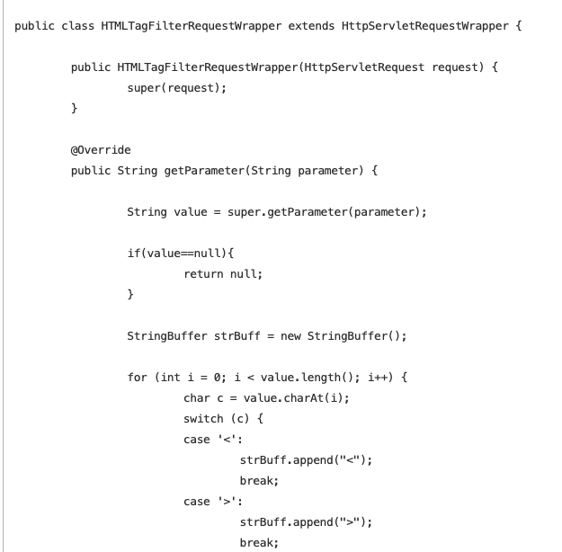

# Filter 작동원리 및 hmall 소스코드 내 HTMLTagFilter.java 분석

설명하기 전 크로스 사이트 스크립팅(XSS)에 대해서 알아야 합니다. 

## 크로스 사아트 스크립팅
~~~
사이트 해킹 기법이며 사용자의 뷰에서 스크립트 코드를 전송시켜 시스템을 해킹하는 방법을 말합니다.
~~~

`<script>`로 시작하는 코드를 전송시켜 아래 해당 내용을 서버에서 실행시키는 방법입니다. HTML에서는 정규식이라는 방법으로 `<`와 같은 기호들은 `&lt;` 와 같은 코드로 변환시켜 서블릿 전송을 합니다.

그런데 호출되는 메서드에서 공통코드 변환 치환자를 대입하려면 작업이 만만치 않습니다. 따라서 `Filter` 를 사용해서 `.do`를 호출하는 경우 강제로 필터를 거치게 만들어 빠르고 쉽게 크로스 사이트 스크립팅 방지를 할 수 있습니다.

전자정부프레임워크에서는 이러한 정규식처리를 보다 쉽고 편라헤 처리하기 위해서 HTMLTagFilter클래스를 구현허여 정규식변환처리를 하고 있습니다.

## 1) Filter 작동원리

필터를 사용하기 위해서는 web.xml에 필터선언 부분을 추가합니다.

`web.xml`
~~~
<filter>
    <filter-name>HTMLTagFilter</filter-name>
    <filter-class>재호가 사용할 패키지 위치를 맞취주기</filter-class>
</filter>    
<filter-mapping>
    <filter-mapping>
    <filter-name>HTMLTagFilter</filter-name>
    <url-pattern>*.do</url-parttern>
</filter-mapping>
~~~

.do로 호출되는 모든 URL은 필터를 거치게 되며 필터에서 정규식 변환처리가 일어납니다.
그리고 패키지 위치를 맞취줍니다.

 

   ### Filter의 작동 과정
 

1. 서블릿 컨테이너는 웹 어플리케이션을 시작할 때 DD파일(web.xml)에 등록된 필터의 인스턴스를 생성하고 init()을 호출한다.

2. 클라이언트 요청이 들어오면 해당하는 필터의 doFilter()를 호출한다.

3. doFilter()에서 작업을 실행하고 다음 필터의 doFilter()를 호출한다.

4. 마지막 필터까지 3번을 반복한다.

5. 마지막 필터는 서블릿의 service()를 호출한다.

6. 서블릿의 service()가 끝나면 service()를 호출했던 이전 필터로 돌아간다.

7. 반복해서 제일 처음 호출됐던 필터까지 돌아간다.

8. 마지막으로 클라이언트에게 응답 결과를 보낸다.

 

## 2) hmall 소스코드 내 HTMLTagFilter.java 분석
 

HTML에서는 HTMLTagFilterRequestWrapper 객체를 호출해서 사용하고 있는 구현 클래스 입니다.

 

실제적으로 정규식을 변환처리를 하는 클래스 입니다.

이렇게 web.xml와 필터클래스 두개만 추가해서 아주 쉽게 크로스 스크립팅을 방지 할 수 있습니다.

