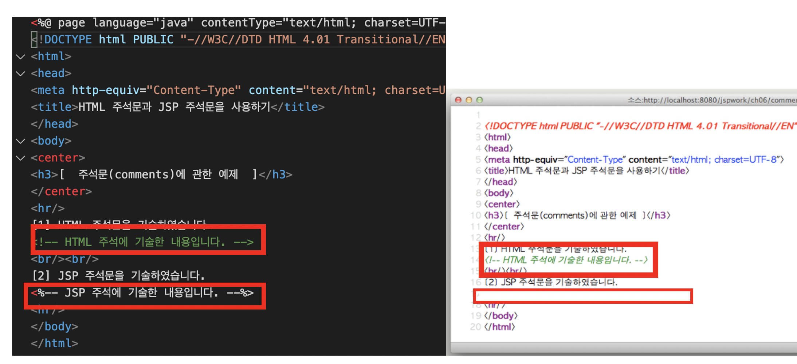

# 4. HTML 주석과 JSP 주석의 차이

## JSP에서 사용할수 있는 주석 
 

## JSP주석 
~~~
    1. <%-- 주석내용 --%>
~~~

   - JSP 컨테이너에서 JSP주석으로 인식 
   - JSP 컨테이너에서 웹 서버로 전달시 버려지므로 Client에 전송불가

 
 

## html주석

~~~
<!-- -->
~~~

   - JSP컨테이너에 의해 해석되지 않고 그대로 웹서버로 전송되어 Client에 전송

 

## html주석 VS JSP
 

1. html 주석은 아래와 같이 소스코드로 보여지게 됩니다.

2. JSP주석 주석은 사용자에게 보이지 않습니다.

 
 
 
 

