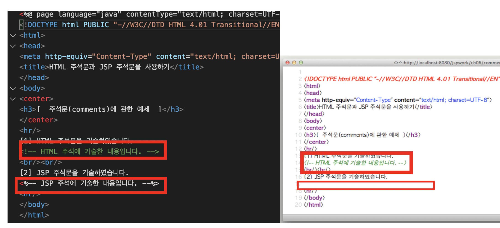

# HTML 주석과 JSP 주석의 차이

## JSP에서 사용할수 있는 주석 
 

1. JSP주석 
~~~
    1. <%-- 주석내용 --%>
~~~

2. 자바 언어 주석 
~~~
     // 주석내용 
     /* 주석내용 */
~~~

3. HTML 주석
~~~
     <!-- 주석 내용 -->
~~~

## html주석
 

~~~
<!-- -->
~~~

## html주석 VS JSP
 

1. html 주석은 아래와 같이 소스코드로 보여지게 된다.

2. JSP주석 주석은 사용자에게 보이지 않는다.

