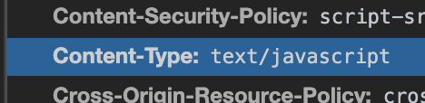
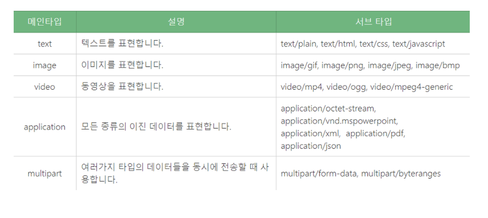

# 자주 사용하는 MIME type 정리

## MIME Type (Multipurpose Internet Mail Extensions)

 

## 구조

가장 단순한 MIME type의 구조는 type과 subtype으로 이루어져 있습니다.
각각은 string이며 이 둘은 슬래시(/)로 구분되고 공백문자는 존재하지 않습니다.

ex1)

ex2)

~~~
type/subtype
~~~

   - type : 일반적인 카테고리 의미
   - subtype : 구체적인 카테고리 식별
   - parameter : 추가적인 디테일 정보를 더하고자 사용 (optional)

## 구성

MIME TYPE은 메인타입/서브타입 식으로 구성됩니다. 예를 들면 image/jpeg, image/png 등과 같이 표현 됩니다.

 

### 정리하면서 혼자 생각한 것들
~~~
1. 업로드를 할때 이것이 PDF인지 JPG인지 client or Server에서는 모른다.
2. 그래서 타입을 지정해준다. (왜냐하면 PDF만 받고 싶으니까) -> 그것을 확장자를 보고 판단한다.
3. 쉽게 생각해서 카카오톡에 업로드 가능한 확장자가 있고 못하는 확장자가 있다.
4. txt로 확장자를 바꾼다음 올리고 확장자만 다시 바꿔주면 손쉽게 업로드가 가능하다.
5. 그럼 왜 막아둘까?
6. 여러가지 측면중에서 보안쪽으로 생각해보면 검사를 안해주고 jsp 파일을 집어넣어서 DB connect 할 수 있는 코드를 짜서 주입시킨다.
7. 그러면 서버 shell에도 접근이 가능하고 그 서버는 장악당했다고 볼 수 있다. (왜냐면 시스템 명령어가 실행될 테니까)
8. 웹 쉘 업로드 공격 (파일 업로드 취약점)
9. 예를 들어 .htaccess 파일 -> 리눅스에서는 화장자가 안보임
10. 그래서 꼭 MIME TYPE을 검사해야 된다.
~~~

 
 
 