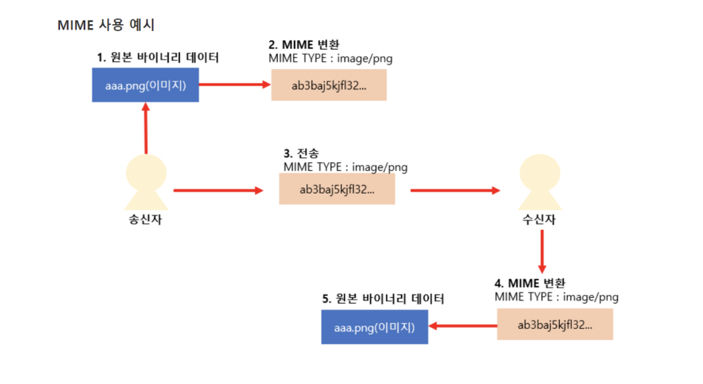
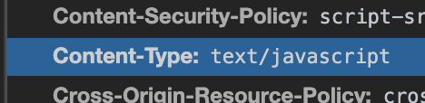
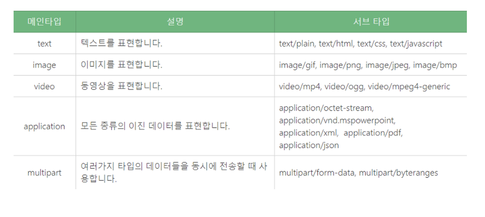
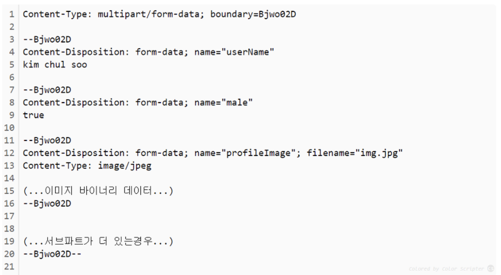

# 1. 자주 사용하는 MIME type 정리

먼저 MIME type에 자세하게 알지 못하여 MIME 부터 알도록 하겠습니다.

## MIME Type (Multipurpose Internet Mail Extensions)

MIME type이란 클라이언트에게 전송된 문서에 대해 알려주기 위한 메커니즘이다.브라우저는 리소스를 내려받았을 때 해야 할 기본 동작이 무엇인지를 MIME 타입을 기반으로 결정한다.
현재 IANA 기관에서 MIME type을 표준화하여 관리한다.
 

이미지나 사진 동영상 파일등은 바이너리 데이터이다. 즉 0과 1의 조합으로 구성되어 있다. 초기 이메일 시스템에서는 본문에 들어갈 텍스트 뿐만 아니라 첨부파일도 전송 가능하게 하기 위해서 바이너리 데이터인 첨부파일을 아스키 코드로 인코딩하는 방법을 찾아야 했다. 즉, 이메일은 아스키 코드로만 주고 받고 할 수 있었다.

MIME이란 Multipurpose Internet Mail Extension 이란 뜻인데, 보면 다목적의 인터넷 메일 확장이라는 뜻이다. 즉, 바이너리 데이터인 첨부파일을 아스키 코드로 인코딩하여 본문에 덧붙이겠다는 뜻이다.(EXtension의 의미)

보낼때 인코딩된 바이너리 데이터(사진,이미지등)가 어떤 타입인지를 명시해야 받는 측에서 그것대로 해석 할 수 있다.

보면 aaa.png라는 이미지를 마임 타입으로 변환하여 전송하고 수신자는 마임타입을 다시 원본 바이너리 데이터로 복호화 한다. 즉, 마임 타입이란 바이너리 -> 아스키 인코딩 방식이라고 보면 될 것 같다. 그리고, 그 바이너리 데이터가 어떤것이냐를 마임 타입에 명시한다. 그래야, 받는 측에서 제대로 복호화 할 수 있으니까

 

## 구조

가장 단순한 MIME type의 구조는 type과 subtype으로 이루어져 있다.
각각은 string이며 이 둘은 슬래시(/)로 구분되고 공백문자는 존재하지 않는다.

ex1)

ex2)

~~~
type/subtype
~~~

   - type : 일반적인 카테고리 의미
   - subtype : 구체적인 카테고리 식별
   - parameter : 추가적인 디테일 정보를 더하고자 사용 (optional)

## 구성

MIME TYPE은 메인타입/서브타입 식으로 구성된다. 예를 들면 image/jpeg, image/png 등과 같이 표현 된다.

 

## application/octet-stream (이진데이터(메인)/8비트 스트림(서브))

8비트 단위로 해석되는 이진 데이터 타입이다.

## multipart/form-data (여러타입/HTML의 form 데이터)

아래 html의 form태그를 보면, 여러개의 MIME타입이 복합적으로 서버에 묶여서 전송 될 수 있다. 바이너리 데이터와 텍스트가 동시에 전송 될 수 있기 때문에 주타입이 Multipart인것이고 부타입이 form-data인것이다. 사용자가 이 폼에 데이터를 입력해서 전송 버튼을 누르게 되면 서버로 http post방식으로 전송이 되는데 http 바디 부분에 입력값이 담기게 되는데, 그 각각의 입력값들은 구분자를 통해 구분된다. 각 입력값 마다 마임 타입이 다르기 때문에 해석 방법이 달라져야 한다. 그렇기 때문에 구분자로 구분을 해놓아야 한다.

~~~
<form action="/inserProfile" method="post" enctype="multipart/form-data">
  이름 : <input type="text" name="userName"> 
  성별 : <input type="checkbox" name="male">남</input>
         <input type="checkbox" name="female">여</input> 
  사진 : <input type="file" name="profileImage"> 
         <input type="submit" value="전송">
</form>
~~~

아래는 HTTP Request 패킷에 어떤식으로 위의 입력값들이 담기는지 보여주는 예시이다. 헤더부분을 보면 Content-Type을 명시하여 바디 부분에 들어간 데이터가 html의 form태그를 통해 전송된 데이터임을 명시하고, boundary(구분자)를 통해서 각 입력값들을 구분하겠다고 명시한다.
이미지 바이너리 데이터는 아스키 코드로 변환된 형태로 존재할것으로 예상된다(확실하지않다)

   - application/x-www-form-urlencoded
   - text/plain
   - multipart/form-data
   
HTTP에서 사용되는 마임 타입들이다. GET방식의 경우에는 http 요청 바디부분에 아무것도 들어가지 않기 때문에, 헤더의 컨텐츠 타입부분에 아무것도 넣지 않아도 된다. 하지만 POST방식에는 헤더의 컨텐츠 타입 부분을 반드시 명시해야 이 HTTP 패킷을 수신한 측에서 정확하게 복호화 할 수 있다.

## HTTP에 사용되는 MIME TYPE들

   - application/x-www-form-urlencoded 
HTTP 요청 바디 부분에 KEY & VALUE의 형태의 입력값이 포함된다.

   - text/plain 
HTTP 요청 바디 부분에 텍스트가 들어간다.

   -  multipart/form-data 
HTTP 요청 패킷 바디 부분에 boundary라고 불리는 구분자를 통해 html의 form태그의 각 입력값들이 구분되어져서 들어가 있는 형태이다.

각 입력값 마다 마임 타입이 다르기 때문에 주타입이 multipart인것이다. 즉, 여러개의 파트로 구성되어 있다는 의미.

왜 구분자를 통해서 입력값을 구분했냐면, HTML의 form태그에서는 텍스트 뿐만 아니라 바이너리 데이터도 인풋으로 담을 수 있기 때문이다. 바이너리 데이터는 GET방식에서의 구분자인 &을 구분자가 아닌 데이터로 인식하기 때문에 &이 아닌 다른 것으로 boundary라는것이 각 인풋을 구분하기 위해서 필요한것이다.

 

### 정리하면서 혼자 생각한 것들
~~~
1. 업로드를 할때 이것이 PDF인지 JPG인지 client or Server에서는 모른다.
2. 그래서 타입을 지정해준다. (왜냐하면 PDF만 받고 싶으니까) -> 그것을 확장자를 보고 판단한다.
3. 쉽게 생각해서 카카오톡에 업로드 가능한 확장자가 있고 못하는 확장자가 있다.
4. txt로 확장자를 바꾼다음 올리고 확장자만 다시 바꿔주면 손쉽게 업로드가 가능하다.
5. 그럼 왜 막아둘까?
6. 여러가지 측면중에서 보안쪽으로 생각해보면 검사를 안해주고 jsp 파일을 집어넣어서 DB connect 할 수 있는 코드를 짜서 주입시킨다.
7. 그러면 서버 shell에도 접근이 가능하고 그 서버는 장악당했다고 볼 수 있다. (왜냐면 시스템 명령어가 실행될 테니까)
8. 웹 쉘 업로드 공격 (파일 업로드 취약점)
9. 예를 들어 .htaccess 파일 -> 리눅스에서는 화장자가 안보임
10. 그래서 꼭 MIME TYPE을 검사해야 된다.
~~~

<참고 링크>

### MIME TYPE 
flask 파일업로드 검증하기 : https://ash84.io/2018/09/10/flask-upload-limit/
 MIME_types 문서 : https://developer.mozilla.org/en-US/docs/Web/HTTP/Basics_of_HTTP/MIME_types
 http://mommoo.tistory.com/60 [개발자로 홀로 서기]
 http://dololak.tistory.com/130 [코끼리를 냉장고에 넣는 방법]
  https://simsimjae.tistory.com/271 [104%]