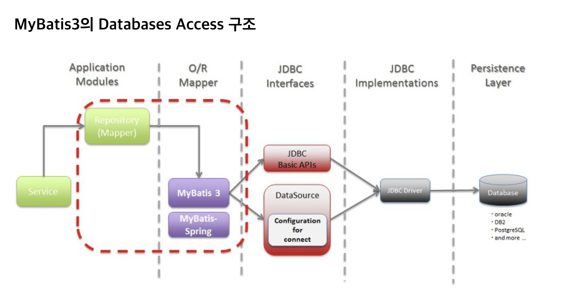
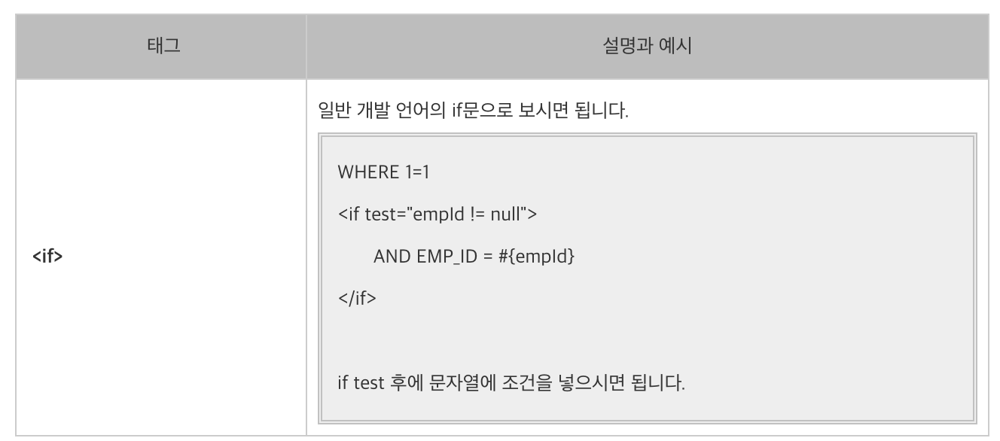

# 1. MyBatis 동적 매핑에 사용되는 tag 및 property 정리

## MyBatis 구조
 

**1. 자바코드 안에 sql 문을 분리하는 것 입니다.**  
**2. 반복되는 코드를 캡슐화 시켜서 객체화 시켜서 간단하게 호출하기 입니다. **

## <myBatis 동적 태그>

iBatis : isEqual, isNotEqaul, isNull, isNotNull, isEmpty, isNotEmpty  
myBatis : if

##   - Ex)

Hmall 에서는 iBatis를 사용

 
 
 
 