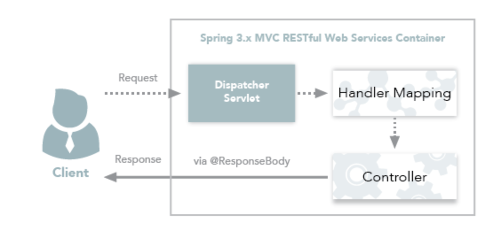
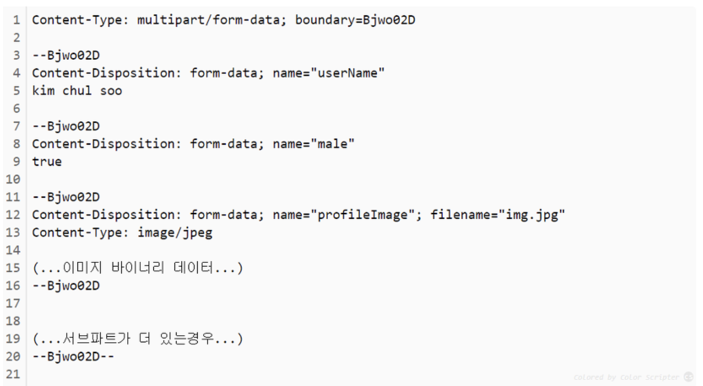
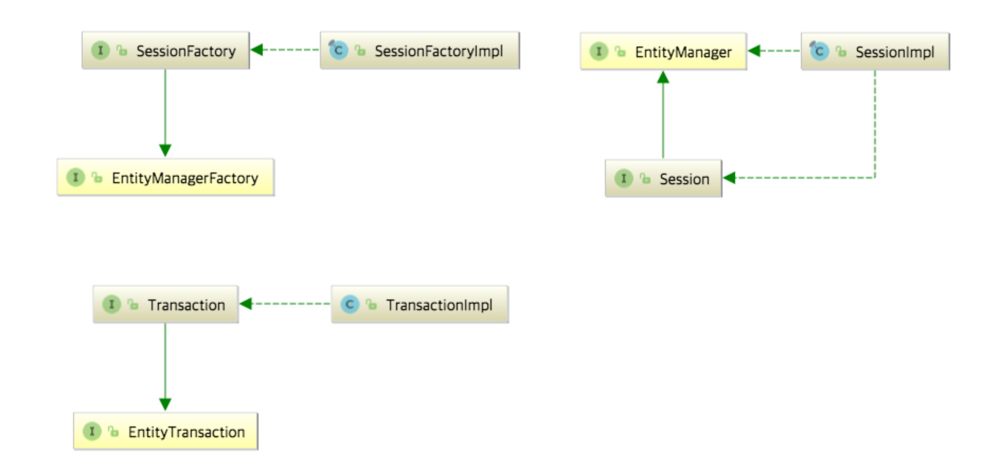

# 1. @Controller와 @RestController 차이
  
   - 들어가기 전에
 Spring에서 컨트롤러를 지정해주기 위한 어노테이션은 @Controller와 @RestController가 있습니다. 전통적인 Spring MVC의 컨트롤러인 @Controller와 Restuful 웹서비스의 컨트롤러인 @RestController의 주요한 차이점은 HTTP Response Body가 생성되는 방식입니다. 이번에는 2가지 어노테이션의 차이와 사용법에 대해 알아보도록 하겠습니다. 

 ## 1. @Controller(Spring MVC Controller)

[ Controller - View ]
전통적인 Spring MVC의 컨트롤러인 @Controller는 주로 View를 반환하기 위해 사용합니다. 아래와 같은 과정을 통해 Spring MVC Container는 Client의 요청으로부터 View를 반환합니다.

Client는 URI 형식으로 웹 서비스에 요청을 보낸다.

Mapping되는 Handler와 그 Type을 찾는 DispatcherServlet이 요청을 인터셉트한다.

Controller가 요청을 처리한 후에 응답을 DispatcherServlet으로 반환하고, DispatcherServlet은 View를 사용자에게 반환한다.

@Controller가 View를 반환하기 위해서는 ViewResolver가 사용되며, ViewResolver 설정에 맞게 View를 찾아 렌더링합니다.

## [ Controller - Data ]
하지만 Spring MVC의 컨트롤러에서도 Data를 반환해야 하는 경우도 있습니다. Spring MVC의 컨트롤러에서는 데이터를 반환하기 위해 @ResponseBody 어노테이션을 활용해주어야 합니다. 이를 통해 Controller도 Json 형태로 데이터를 반환할 수 있습니다.

Client는 URI 형식으로 웹 서비스에 요청을 보낸다.

Mapping되는 Handler와 그 Type을 찾는 DispatcherServlet이 요청을 인터셉트한다.

@ResponseBody를 사용하여 Client에게 Json 형태로 데이터를 반환한다.

@RestController가 Data를 반환하기 위해서는 viewResolver 대신에 HttpMessageConverter가 동작합니다. HttpMessageConverter에는 여러 Converter가 등록되어 있고, 반환해야 하는 데이터에 따라 사용되는 Converter가 달라집니다. 단순 문자열인 경우에는 StringHttpMessageConverter가 사용되고, 객체인 경우에는 MappingJackson2HttpMessageConverter가 사용되며, 데이터 종류에 따라 서로 다른 MessageConverter가 작동하게 됩니다. Spring은 클라이언트의 HTTP Accept 헤더와 서버의 컨트롤러 반환 타입 정보 둘을 조합해 적합한 HttpMessageConverter를 선택하여 이를 처리합니다.

### [ @Controller 예제 코드 ]
~~~
package com.mang.blog.application.user.controller;

import com.mang.blog.application.user.model.UserVO;
import com.mang.blog.application.user.service.UserService;
import org.springframework.stereotype.Controller;
import org.springframework.ui.Model;
import org.springframework.web.bind.annotation.RequestBody;
import org.springframework.web.bind.annotation.GetMapping;
import org.springframework.web.bind.annotation.PostMapping;
import org.springframework.web.bind.annotation.RequestMethod;
import org.springframework.web.bind.annotation.ResponseBody;

import javax.annotation.Resource;

@Controller
@RequestMapping("/user")
public class UserController {

    @Resource(name = "userService")
    private UserService userService;

    @PostMapping(value = "/retrieveUserInfo")
    public @ResponseBody UserVO retrieveUserInfo(@RequestBody UserVO userVO){
        return userService.retrieveUserInfo(userVO);
    }
    
    @GetMapping(value = "/userInfoView")
    public String userInfoView(Model model, @RequestParam(value = "userName", required = true) String userName){
        UserVO userVO = userService.retrieveUserInfo(userName);
        model.addAttribute("userInfo", userVO);
        return "/user/userInfoView";
    }

}
~~~

위 예제의 retrieveUserInfo는 UserVO라는 데이터를 반환하고자 하고 있고, UserVO를 json으로 반환하기 위해 @ResponseBody라는 어노테이션을 붙여주고 있다. userInfoView 함수에서는 View를 전달해주고 있기 때문에 String을 반환값으로 설정해주었다.

## 2. @RestController(Spring Restful Controller)

[ RestController ]
@RestController는 Spring MVC Controlle에 @ResponseBody가 추가된 것입니다. 당연하게도 RestController의 주용도는 Json 형태로 객체 데이터를 반환하는 것입니다. 개인적으로는 VueJS + Spring boot 프로젝트를 진행하며 Spring boot를 API 서버로 활용할 때 또는 Android 앱 개발을 하면서 데이터를 반환할 때 사용하였습니다.

Client는 URI 형식으로 웹 서비스에 요청을 보낸다.

Mapping되는 Handler와 그 Type을 찾는 DispatcherServlet이 요청을 인터셉트한다.

RestController는 해당 요청을 처리하고 데이터를 반환한다.

[ @RestController 예제 코드 ]

~~~
package com.mang.blog.application.user.controller;

import com.mang.blog.application.user.model.UserVO;
import com.mang.blog.application.user.service.UserService;
import org.springframework.http.HttpStatus;
import org.springframework.http.ResponseEntity;
import org.springframework.web.bind.annotation.RequestBody;
import org.springframework.web.bind.annotation.RequestMapping;
import org.springframework.web.bind.annotation.RequestMethod;
import org.springframework.web.bind.annotation.RestController;

import javax.annotation.Resource;

@RestController
@RequestMapping("/user")
public class UserController {

    @Resource(name = "userService")
    private UserService userService;

    @PostMapping(value = "/retrieveUserInfo1")
    public UserVO retrieveUserInfo1(@RequestBody UserVO userVO){
        return userService.retrieveUserInfo(userVO);
    }

    @PostMapping(value = "/retrieveUserInfo2")
    public ResponseEntity<UserVO> retrieveUserInfo2(@RequestParam(value = "userName", required = true) String userName){
        userVO = userService.retrieveUserInfo(userName);

        if(userVO == null){
            return new ResponseEntity<>(HttpStatus.NOT_FOUND);
        }

        return new ResponseEntity<>(userVO, HttpStatus.OK);
    }

    @PostMapping(value = "/retrieveUserInfo3")
    public ResponseEntity<UserVO> retrieveUserInfo3(@RequestParam(value = "userName", required = true) String userName){
        return Optional.ofNullable(userService.retrieveUserInfo(userName))
                .map(userVO -> new ResponseEntity<>(userVO, HttpStatus.OK))
                .orElse(new ResponseEntity<>(HttpStatus.NOT_FOUND));
    }
}
~~~

retrieveUserInfo1의 메소드는 UserVO를 그대로 반환하고 있습니다. 하지만 이렇게 처리하는 것 보다 retrieveUserInfo2처럼 결과 데이터와 상태코드를 함께 제어하여 반환하는 것이 좋습니다. 그리고 만약 userService에서 반환하는 형태가 Optional이라면 retrieveUserInfo3 처럼 깔끔하게 처리를 해줄 수 있습니다.

 

# SETTER GETTER

~~~
private : 같은 클래스 내에서만 접근 가능

default : 같은 패키지 내에서만 접근 가능

protected : 같은 패키지내 또는 자손 클래스일 경우 접근 가능

public : 제한 없음
~~~

## 캡슐화
접근 제한자는 객체지향의 캡슐화, 그리고 그를 통한 코드 은닉화를 위한 도구이다. 데이터를 외부로부터 숨기거나, 접근을 막고, 또는 접근에 처리를 강제화한다.

 
이전에 oop 캡슐화에 대해서 정리한 글이 있다. 객체지향을 공부하면서 캡슐화를 정확히 몰랐고, 은닉화와 구분하지 못해서 정리했던 기억이 난다. 그때 캡슐성을 아래 3개로 정리했다.

~~~
Encapsulation

1) 유사한 기능이나 변수를 한 집합으로 하여 더 관리하기 쉽게하고 코드를 명확히 함.

2) 외부에서 멤버를 엑세스하는 방법을 지정할 수 있도록, 직접 접근을 막거나 접근 전 부가적인 처리를 요구함.

3) 정보를 외부에 은닉하여 외부에서는 해당 집합의 세부 내용에 집중하지 않도록 함
~~~

 1번은 클래스나 구조체처럼, 객체의 속성이나 행위를 집합화하는 것을 말한다.

 
 2번과 3번은 접근 제한자, 특히 'Getter / Setter의 사용 이유'와 '은닉성'을 각각 설명하고 싶었다.

 ## Setter
getter와 setter를 처음 접했을 때 왜 굳이 변수를 private으로 하고, 다른 메소드를 통해 제어하는지 이해가 전혀 되지 않았다. 아마 처음 c#이나 java를 접한 사람들도 그럴 것 같다.

 

아래 코드에서 jinhwan이라는 사람의 나이에 -1이 대입되었다.

 

쉽게 보기 위해 main에서 직접 대입했지만, 더 복잡한 코드에서 다른 메소드에 의해 값이 변경되고, 이상한 값이 age에 들어오면 문제를 파악하기 쉽지 않을 것이다.

~~~
class Application{
    public static void main(String[] args){
        Person jinhwan = new Person();
        jinhwan.age = -1;
        jinhwan.howOld();
    }
}

class Person{
    int age;

    void howOld(){
        System.out.println(age);
    }
}
~~~
 

이번에는 age를 private으로 해서 직접 값 할당을 못하게 제한하고, 메소드를 이용해서 age에 -1을 대입했다. 단, 이때는 나이는 음수가 될 수 없으므로 음수가 입력되면 0을 대입하도록 하여 나이에 음수가 대입되는 상황을 처리하였다.

 

이런식으로 잘못된 입력에 기본 값을 대입하거나, 에러를 출력하고 시스템이 종료되게 하는 것으로 문제를 확인하는 처리가 대표적이다. 

~~~
class Application{
    public static void main(String[] args){
        Person jinhwan = new Person();
        jinhwan.setAge(-1);
        jinhwan.howOld();
    }
}

class Person{
    private int age;

    public void setAge(int age) {
        if(age >=0){
            this.age = age;
        }
        else
            this.age = 0;
    }
    
    void howOld(){
        System.out.println(age);
    }
}
~~~

setter는 이렇게 변수의 값 대입이 여러 곳에서, 제한 없이 가능한 것을 접근 제한자로 막고, 접근 범위에 한해서 메소드로 대입전 값을 처리 후 대입되게 하기 위해 사용된다.

 

이때 setter는 set+'Variablename'으로 이름 짓는 것이 보편적이다.

 ## Getter / 은닉성
메소드를 통해 값을 대입하는 것은 대입전 사전 처리가 필요하니 그럴 수 있다고 치자. Getter는 왜 쓰는 걸까. 어차피 그 값에 영향을 미치지 않으면 값을 가져오는거야 자유롭게 하면 안될까?

 

큰 프로젝트에서 엄청 긴 코드를 다룬다고 생각해보자. 다른 사람의 코드 속 모든 변수 값을 가져올 필요도 없을 뿐더러, 가져올 수 있는 것이 마냥 편한 일은 아닐 것이다.

 

자동차 게임을 개발하는 상황을 가정해보자. 만약 당신이 자동차가 충돌 시 튕겨나가는 이벤트 처리를 만드는 일을 담당한다면, 충돌하는 자동차의 색상이나, 브랜드를 알야할까? 아마 불필요한 정보에 신경이 빼앗길 것이다.

~~~
class Application{
    public static void main(String[] args){
        Person jinhwan = new Person();
    }
}

class Person{
    int age;
    int name;
    String hobby;
    int hobby_id;
    String school;
    int school_id;
    String phoneNumber;
    int gender;
    int pw;
}
~~~
자동차 객체를 가져다 쓸 때 차종, 색, 휠, 차량 넘버, 제조사 등의 잡다한 정보는 자동차를 구현한 사람들의 몫이고, 다른 사람에게 방해만 될 뿐이다.

 
위 코드에서 age와 name을 제외하곤, 다른 사람에게 불필요한 정보이다.

~~~
class Person{
    private int age;
    private int name;
    
    private String hobby;
    private int hobby_id;
    private String school;
    private int school_id;
    private String phoneNumber;
    private int gender;
    private int pw;

    public int getAge() {
        return age;
    }

    public int getName() {
        return name;
    }

    public void setAge(int age) {
        if(age >=0){
            this.age = age;
        }
        else
            this.age = 0;
    }
}
~~~

이번에는 변수의 접근을 private처리해서 해당 클래스 안에서만 노출되게 바꾸고, 다른 사람들도 사용할 필요가 있는 주요 변수 age, name만 getter을 이용해서 드러냈다.  

이렇게 변수들의 외부 노출을 제한하고, 노출 범위를 정해주는 것이 Getter고, 그러한 속성이 은닉성이다.

 자바의 Lombok 라이브러리
get, set 자동 구현 프로퍼티를 제공하는 c#과 달리, 자바는 롬복이라는 라이브러리를 추가하여 어노테이션으로 getter와 setter를 변수에 처리할 수 있다.

 

스프링을 공부하면서 정리한 롬복 설정 방법을 참고한다.
-> https://ecsimsw.tistory.com/entry/%EB%A1%AC%EB%B3%B5-%EC%84%A4%EC%B9%98?category=879374

 

# JPA

Spring 프레임워크는 어플리케이션을 개발할 때 필요한 수많은 강력하고 편리한 기능을 제공해준다. 하지만 많은 기술이 존재하는 만큼 Spring 프레임워크를 처음 사용하는 사람이 Spring 프레임워크에 대한 정확한 이해를 하기는 매우 어렵다.

내가 특히 오랜 기간동안 혼란스러워했던 부분은 JPA와 관련된 개념이었다. JPA 관련 서적을 읽을 때에는 분명 EntityManager를 통해 entity CRUD를 했는데, 실제 어플리케이션 코드를 보니 EntityManager는 찾아볼 수 없고 웬 Repository 인터페이스라는 놈만 쓰이고 있었다. 덕분에 내 안에서는 JPA, Hibernate, Repository에 대한 개념이 뒤섞이게 되었고, 개념을 바로 잡는 데에 꽤나 많은 노력을 기울여야만 했다.

개인적으로 나는 사용하는 기술에 대해 정확한 개념을 가지고 있는 것이 좋은 코드의 시작점이라 생각한다. 그래서 이러한 개념의 혼동을 줄이는 데에 조금이나마 도움이 되기 위해 이번 글에서는 JPA, Hibernate, 그리고 Spring Data JPA(Repository)의 차이점에 대해 서술하였다.

 

# JPA는 기술 명세이다

JPA는 Java Persistence API의 약자로, 자바 어플리케이션에서 관계형 데이터베이스를 사용하는 방식을 정의한 인터페이스이다. 여기서 중요하게 여겨야 할 부분은, JPA는 말 그대로 인터페이스라는 점이다. JPA는 특정 기능을 하는 라이브러리가 아니다. 마치 일반적인 백엔드 API가 클라이언트가 어떻게 서버를 사용해야 하는지를 정의한 것처럼, JPA 역시 자바 어플리케이션에서 관계형 데이터베이스를 어떻게 사용해야 하는지를 정의하는 한 방법일 뿐이다.

JPA는 단순히 명세이기 때문에 구현이 없다. JPA를 정의한 javax.persistence 패키지의 대부분은 interface, enum, Exception, 그리고 각종 Annotation으로 이루어져 있다. 예를 들어, JPA의 핵심이 되는 EntityManager는 아래와 같이 javax.persistence.EntityManager 라는 파일에 interface로 정의되어 있다.

~~~
package javax.persistence;

import ...

public interface EntityManager {

    public void persist(Object entity);

    public <T> T merge(T entity);

    public void remove(Object entity);

    public <T> T find(Class<T> entityClass, Object primaryKey);

    // More interface methods...
}
~~~

## Hibernate는 JPA의 구현체이다

Hibernate는 JPA라는 명세의 구현체이다. 즉, 위에서 언급한 javax.persistence.EntityManager와 같은 인터페이스를 직접 구현한 라이브러리이다. JPA와 Hibernate는 마치 자바의 interface와 해당 interface를 구현한 class와 같은 관계이다.

위 사진은 JPA와 Hibernate의 상속 및 구현 관계를 나타낸 것이다. JPA의 핵심인 EntityManagerFactory, EntityManager, EntityTransaction을 Hibernate에서는 각각 SessionFactory, Session, Transaction으로 상속받고 각각 Impl로 구현하고 있음을 확인할 수 있다.

“Hibernate는 JPA의 구현체이다”로부터 도출되는 중요한 결론 중 하나는 JPA를 사용하기 위해서 반드시 Hibernate를 사용할 필요가 없다는 것이다. Hibernate의 작동 방식이 마음에 들지 않는다면 언제든지 DataNucleus, EclipseLink 등 다른 JPA 구현체를 사용해도 되고, 심지어 본인이 직접 JPA를 구현해서 사용할 수도 있다. 다만 그렇게 하지 않는 이유는 단지 Hibernate가 굉장히 성숙한 라이브러리이기 때문일 뿐이다.

<참고 링크> 
Getter , Setter : https://ecsimsw.tistory.com/387
 
JPA :  https://suhwan.dev/2019/02/24/jpa-vs-hibernate-vs-spring-data-jpa/

