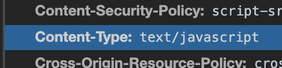

# 1. 자주 사용하는 MIME type 정리

먼저 MIME type에 자세하게 알지 못하여 MIME 부터 알도록 하겠습니다.

## MIME Type (Multipurpose Internet Mail Extensions)

MIME type이란 클라이언트에게 전송된 문서에 대해 알려주기 위한 메커니즘이다.브라우저는 리소스를 내려받았을 때 해야 할 기본 동작이 무엇인지를 MIME 타입을 기반으로 결정한다.
현재 IANA 기관에서 MIME type을 표준화하여 관리한다.

이게 PDF인지 아닌지 ?  클라가 모를수도 있고 서버가 모를수도있다..
근데 애네들은 모르니까 타입을 지정해준다. 이게 해석이 될때 PDF로 해석이  그게 없으면

브라우저에서 해석할수도있고 서버사이드에서 해석할수도 있고

내가 pdf만 업로들를 받을라고 한다 근데 마인타입 검증을 안해주면 이게 pdf인지 아닌지 모른다.
확장자가지고 검증할수있다...
랜더링을 한다.. 
카카오톡을 보낼때 mime type을 검사를 한다는 것은 파일 타입값을 다 검사를 한다음에 
막아두는 이유 -> 
마임타입을 검사하는게 내가 들어온 파일을 메모리에 담아 메모리에 담고 앞에 4바이트
들어온 컨텐츠 타입에 대해서 내가 허락한 컨텐츠 타입인지 파일안에 들어온 파일이 ㅎ실제 pdf파일인지 검사하고
내가 jsp로 짰는데 코드를 넣었어 시스템 명령어를 실행시킬수 있는 파라미터를 받을 수 있는 걳을 만들었어 파일에
경로 알게되면 그러면 난 형의 서버를 장악한거야 시스템 명령어가 실행될테니까 ... 
connect 파일 같은것도 실제로 점검 나가서 됐던건데 dp connect파일을 업로드를 해 게시판에서
내꺼 db로 주기적으로 쏘는거야 확장자 검사만 하면 무조건 뚫린다. 왜냐면 jsp를 업로드 하던 그 뒤에 .pdf를
붙는 것을 필터링만 우회만 하면 .. 실제 실행될때 뒤에 확장자를 무시해버릴수도있고
.htxx 확장자를 가지고 뭘로 실행해라 라는 환경파일인데 
이걸 찾으면 pdf라는 확장자를 jsp로 인식해라 라는 파일 txt/utf-8
그러면 업로드 들어가도 확장자 주작 가능
카톡올릴때도 그렇게 주작질 htxx는 pdf로 올라온건 jsp로 실행해라 그럼 .pdf라고 해도 jsp 코드니까
재호.htxx.jpg

리눅스에서는 확장자라는 개념이 없으니 그래서 문제가 발생한다.

 

## 구조

가장 단순한 MIME type의 구조는 type과 subtype으로 이루어져 있다.
각각은 string이며 이 둘은 슬래시(/)로 구분되고 공백문자는 존재하지 않는다.

ex1)

ex2)

~~~
type/subtype
~~~

   - type : 일반적인 카테고리 의미
   - subtype : 구체적인 카테고리 식별
   - parameter : 추가적인 디테일 정보를 더하고자 사용 (optional)

<참고 링크> 
flask 파일업로드 검증하기 : https://ash84.io/2018/09/10/flask-upload-limit/