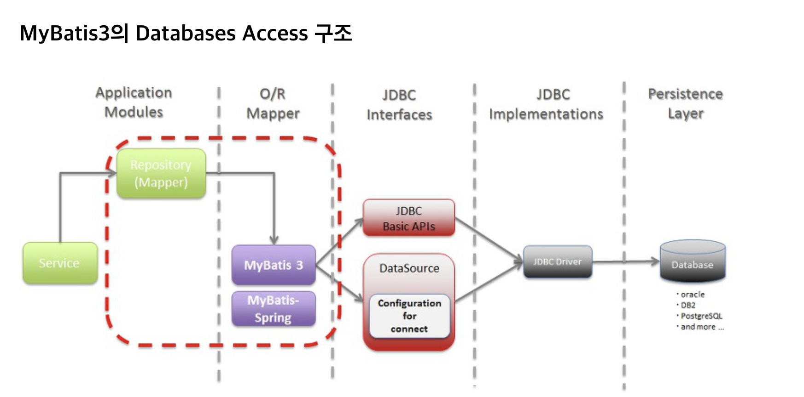

# A.equals(B) vs B.equals(A)

기존에 문자열 비교를 할 때는 당연히 String 클래스의 equals() 메소드를 사용하라고 암기적으로 외워왔을 것입니다.

`java.lang.Object `
~~~

package java.lang;

public class Object{
   //....

   public boolean equals(Object obj) {
        return (this == obj);
    }

   //....
}
~~~

이렇게만 확인하다고 알고 있었고 더 찾아보니 정확하게 아래와 같이 코드가 구현되어 있었습니다.

~~~
public boolean equals(Object anObject) {
        if (this == anObject) {
            return true;
        }
        if (anObject instanceof String) {
            String anotherString = (String)anObject;
            int n = value.length;
            if (n == anotherString.value.length) {
                char v1[] = value;
                char v2[] = anotherString.value;
                int i = 0;
                while (n-- != 0) {
                    if (v1[i] != v2[i])
                        return false;
                    i++;
                }
                return true;
            }
        }
        return false;
    }
~~~

1. 참조값 비교.
2. String으로 타입변환 가능 비교
3. 문자열 길이비교
4. charArray를 활용하여 직접 값비교

equals()를 사용하면서 주의할 점은 다음과 같이 str1이 null이라면 NullPointerException이 발생합니다.
~~~
String str1 = null;
String str2 = "World";
System.out.println("a.equals(b) : " + str1.equals(str2));
~~~

NPE 발생 => `null은 객체가 아니기 때문에 당연히 "equlas" 라는 메서드도 없기 때문입니다.`

반대로 인자로 전달되는 객체는 null이라도 NullPointerException가 발생하지 않습니다.
~~~
String str1 = "Hello";
String str2 = null;
System.out.println("a.equals(b) : " + str1.equals(str2));
~~~

## 해결방안

1) 사실 이런 NullPointerException이 발생하는 것을 신경쓰고 싶지 않다면 Objects.equals()를 사용하여 두개의 객체를 비교할 수 있습니다.

~~~
System.out.println("str1 == str2 ? " + Objects.equals(str1, str2));
System.out.println("str1 == str3 ? " + Objects.equals(str1, str3));
~~~

   - Objects 클래스에 구현되어있는 코드를 보면 Null을 체크하기 때문에 NullPointerException이 발생하지 않습니다.

~~~
// Objects.java
public static boolean equals(Object a, Object b) {
    return (a == b) || (a != null && a.equals(b));
}
~~~

 

<!--  -->

<참고 링크>

https://goddaehee.tistory.com/126

https://m.blog.naver.com/demonic3540/221856924291