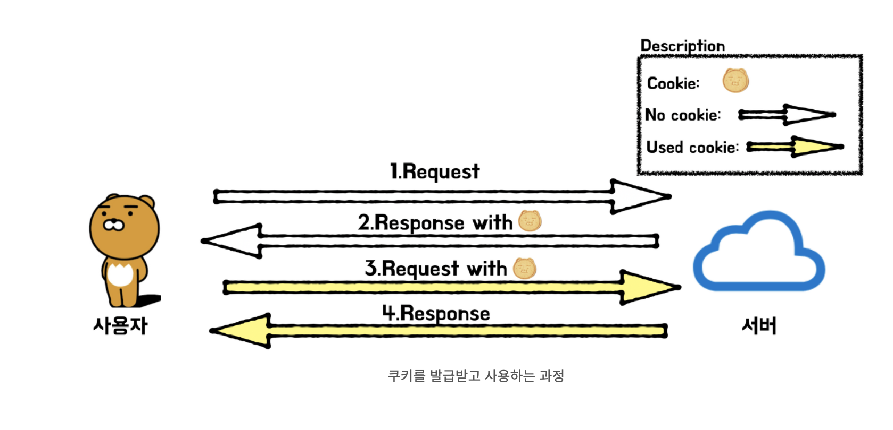

# MyBatis 동적 매핑에 사용되는 tag 및 property 정리

## MyBatis란? 
 
객체 지향 언어인 자바의 관계형 데이터베이스 프로그래밍을 좀 더 쉽게 할 수 있게 도와 주는 개발 프레임 워크로서 JDBC를 통해 데이터베이스에 엑세스하는 작업을 캡슐화하고 일반 SQL 쿼리, 저장 프로 시저 및 고급 매핑을 지원하며 모든 JDBC 코드 및 매개 변수의 중복작업을 제거 합니다. Mybatis에서는 프로그램에 있는 SQL쿼리들을 한 구성파일에 구성하여 프로그램 코드와 SQL을 분리할 수 있는 장점을 가지고 있습니다. 

 

## MyBatis 구조
 

**1. 자바코드 안에 sql 문을 분리하는 것 입니다.**  
**2. 반복되는 코드를 캡슐화 시켜서 객체화 시켜서 간단하게 호출하기 입니다. **

iBatis 에서 사용되는 기본 동적 태그(Binary Conditional Tag) 
~~~
prepend - 태그 조건에 맞아 실행될 sql문에 선행하여 붙을 속성

property - 매개변수 명

compareProperty - 비교할 다른 매개변수명

compareValue - 비교대상이 될 값 
~~~

## <myBatis 동적 태그>

iBatis : isEqual, isNotEqaul, isNull, isNotNull, isEmpty, isNotEmpty  
myBatis : if

※ if문 사용 시 주의점.(따옴표 주의) 문자열 비교시 주의점.
~~~
<if test="name.equals('kim')"></if>             // 정상 작동하지 않음 
<if test='name.equals("kim")'></if>             // 정상 작동
~~~

choose, when otherwise - oracle case문 과 같이 케이스에 따라 조건이 달라질 때

iBatis의 iterate와 비슷한 태그도 존재한다.

bind - 변수를 만드는 태그

<참고 링크>

https://shlee0882.tistory.com/205

https://www.youtube.com/watch?v=inZMVkyyHTE

https://khj93.tistory.com/entry/MyBatis-MyBatis%EB%9E%80-%EA%B0%9C%EB%85%90-%EB%B0%8F-%ED%95%B5%EC%8B%AC-%EC%A0%95%EB%A6%AC